<div align="center">


# Voice Translator AI

**An offline-storage, OpenAI-powered voice & text translation suite built with Flutter**

[](https://flutter.dev)
[](https://dart.dev)
[](#)
[](https://platform.openai.com)
[](#)
[](LICENSE)

</div>

---

## Overview

**Voice Translator AI** is a Flutter application that wraps OpenAI's speech and language models (Whisper-class transcription, GPT-4o for translation/text tasks, and TTS for speech synthesis) into a single, polished mobile toolkit. It covers the full loop of spoken communication — **voice → text → translation → voice** — plus text-only translation, a two-person conversation interpreter, and text-to-speech generation, all wrapped in a themeable, fully localized interface.

The project started as a personal tool and grew into a fairly complete product: persistent history with folders and favorites, optional Telegram forwarding of results, data backup/restore, Android share-intent integration, and a from-scratch localization layer supporting **29 languages**.

> 🔑 The app is a client for your own OpenAI API key — there is no backend server. All keys, history and preferences are stored **locally on the device** via `shared_preferences` / local files.

## Screenshots

<table>
<tr>
<td align="center">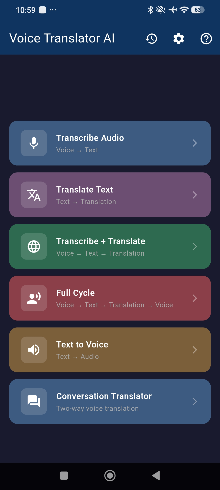<br/><sub>Home</sub></td>
<td align="center">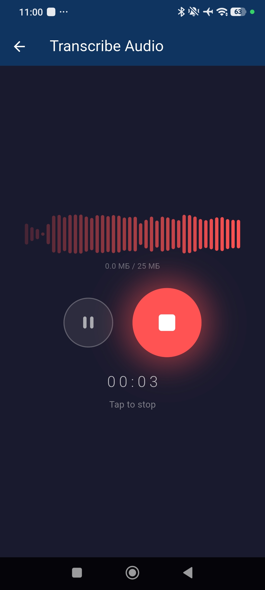<br/><sub>Transcribe Audio — Recording</sub></td>
<td align="center">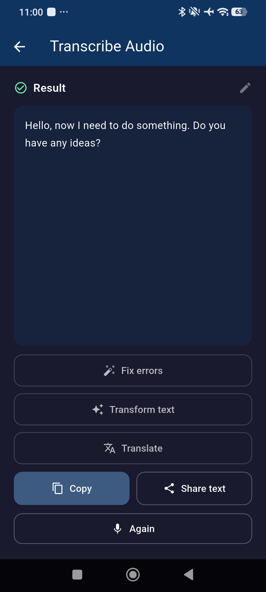<br/><sub>Transcribe Audio — Result</sub></td>
<td align="center">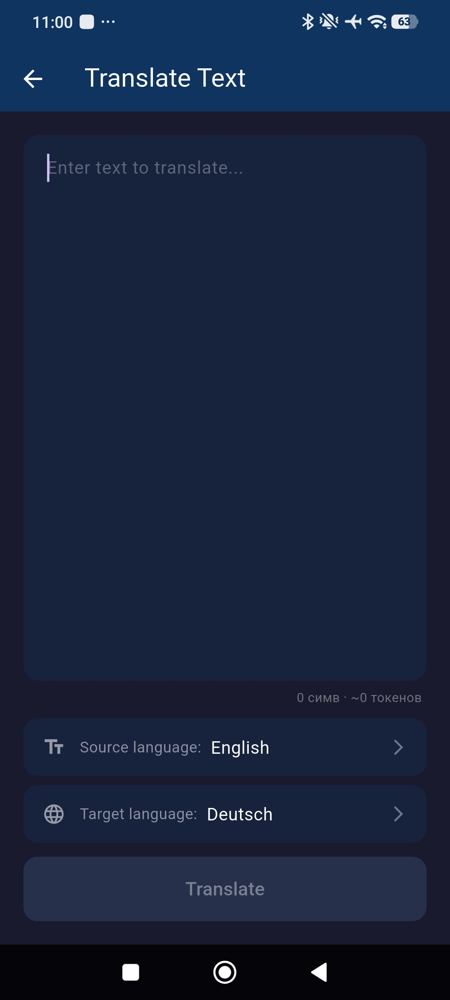<br/><sub>Translate Text</sub></td>
<td align="center">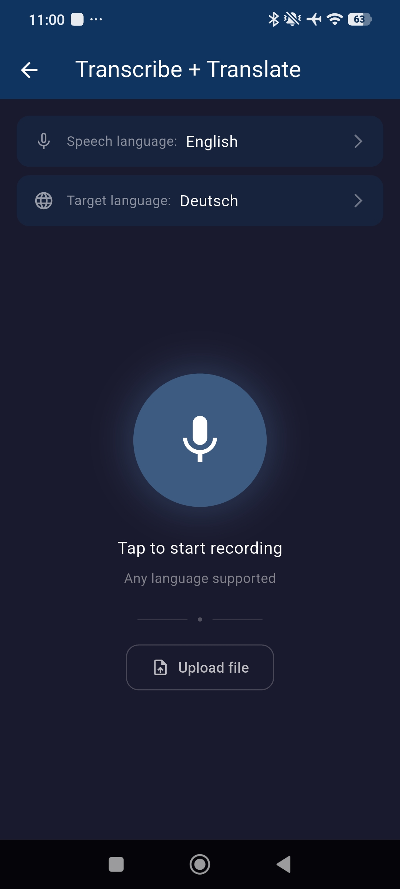<br/><sub>Transcribe + Translate</sub></td>
</tr>
<tr>
<td align="center">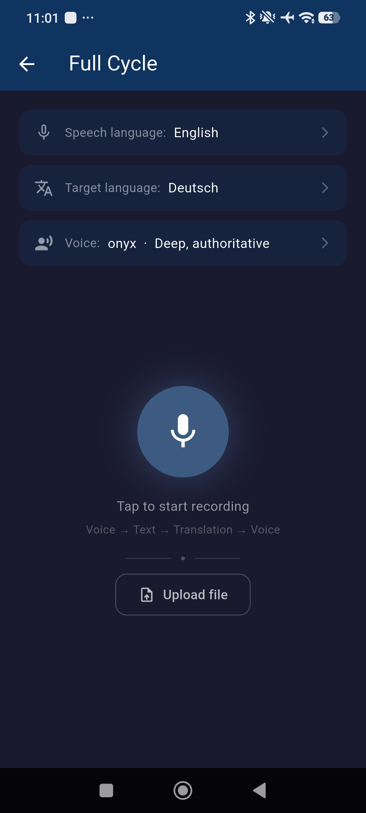<br/><sub>Full Cycle</sub></td>
<td align="center">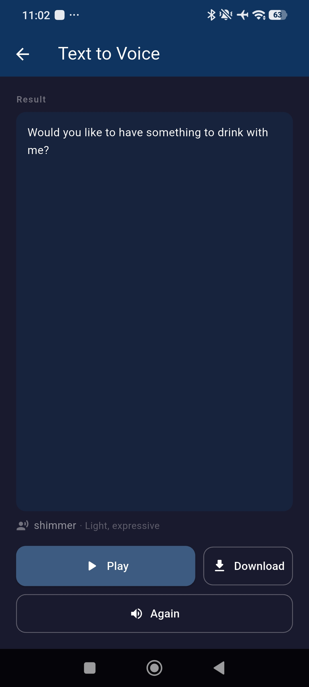<br/><sub>Text to Voice</sub></td>
<td align="center">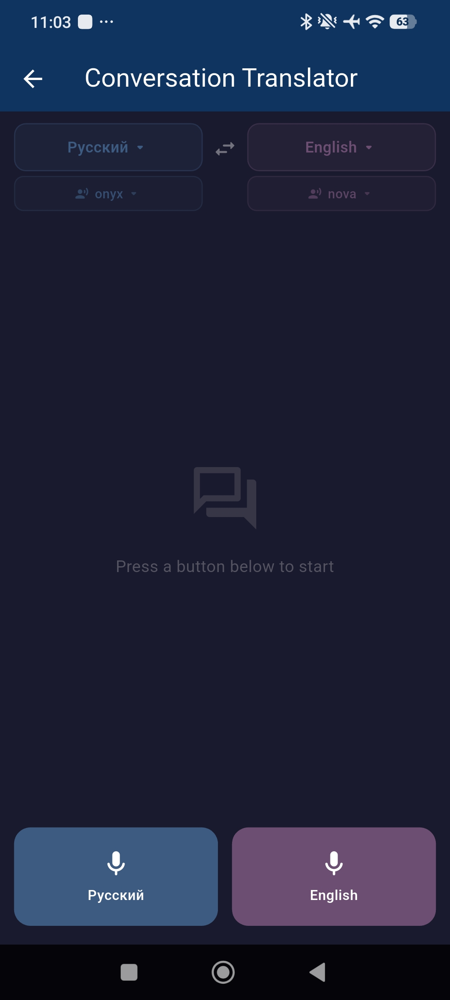<br/><sub>Conversation Translator</sub></td>
<td align="center">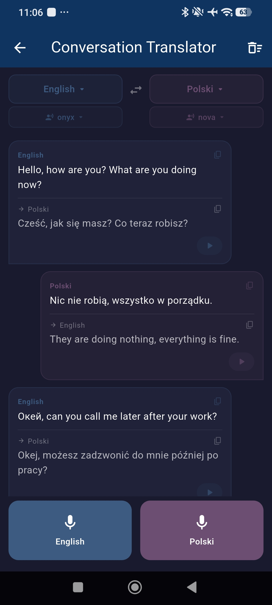<br/><sub>Conversation in Progress</sub></td>
<td align="center">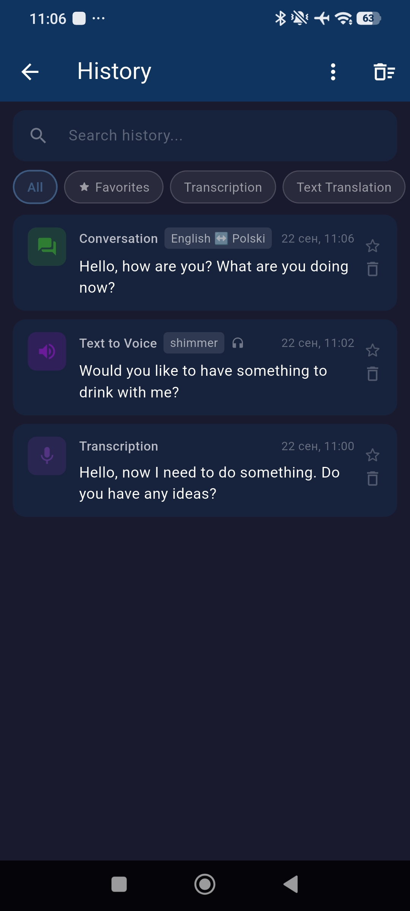<br/><sub>History</sub></td>
</tr>
</table>

## Features

### Core AI tools
- **Transcribe Audio** — record or upload audio and get a transcript (Whisper-class `gpt-4o-transcribe`), with optional source-language hinting or auto-detect.
- **Translate Text** — type or paste text and translate it into any of 29 supported languages via GPT-4o.
- **Transcribe + Translate** — record speech and get both the original transcript and its translation in one pass.
- **Full Cycle** — speech → text → translation → speech: records your voice, translates it, and speaks the translation back in a chosen AI voice.
- **Text to Voice** — generate natural-sounding speech (9 selectable voices) from any text and export it as MP3.
- **Conversation Translator** — a two-way interpreter mode for face-to-face conversations: each speaker records in their own language and the app translates and speaks the reply back automatically.

### History & organization
- Every operation is saved to a searchable, filterable history with type badges, favorites, and custom folders.
- Conversation entries are stored as a full turn-by-turn transcript, not just a flat text blob.
- **Per-block editing**: individual turns in a conversation can be removed with a right-to-left swipe or a long-press-to-confirm gesture (with undo), both live and when reopening a saved conversation from history.
- Export/import full history as a backup file, or export a single conversation as plain text.

### Integrations
- **Telegram forwarding** — optionally mirror any result (transcript, translation, TTS audio, conversation turn) to a Telegram bot/chat. Sending can be paused independently from the stored bot token/chat ID, and credentials can be cleared separately — so muting notifications never requires re-entering keys.
- **Android Share Intent** — receive shared text or audio/files from any other app directly into the relevant translation/transcription flow.

### Personalization
- 24 built-in color themes (multicolor and monochrome families) for the home screen and buttons.
- Full UI localization across **29 interface languages**, independent from the 29 languages available for translation/transcription (see [Localization](#localization)).
- Language pickers show the localized language name as a subtitle (e.g. a Korean UI shows "일본어" under "日本語"), so unfamiliar scripts stay identifiable regardless of which interface language is active.

## Tech Stack

| Layer | Choice |
|---|---|
| Framework | [Flutter](https://flutter.dev) (Dart ≥ 3.11) |
| State management | [`provider`](https://pub.dev/packages/provider) (`ChangeNotifier` services/providers) |
| AI backend | [OpenAI API](https://platform.openai.com) — transcription, chat completions, TTS |
| Local persistence | [`shared_preferences`](https://pub.dev/packages/shared_preferences) + local file storage |
| Audio recording | [`record`](https://pub.dev/packages/record) |
| Audio playback | [`just_audio`](https://pub.dev/packages/just_audio) |
| Networking | [`http`](https://pub.dev/packages/http) |
| Sharing | [`share_plus`](https://pub.dev/packages/share_plus), [`receive_sharing_intent`](https://pub.dev/packages/receive_sharing_intent) |
| Files | [`path_provider`](https://pub.dev/packages/path_provider), [`file_picker`](https://pub.dev/packages/file_picker), [`archive`](https://pub.dev/packages/archive) (backup export) |
| Permissions | [`permission_handler`](https://pub.dev/packages/permission_handler) |

## Architecture

The app follows a simple, pragmatic layered structure — no code generation, no routing package, no backend of its own.

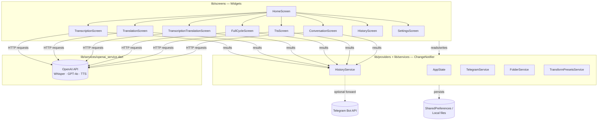

- **`lib/models`** — plain data types: history items/folders, theme definitions, supported-language tables.
- **`lib/services`** — I/O and business logic: `OpenAIService` (all OpenAI HTTP calls), `TelegramService`, `HistoryService`, `FolderService`, `BackupService`, `TransformPresetsService`.
- **`lib/providers`** — app-wide `AppState` (API key, active locale, active color theme).
- **`lib/screens`** — one file per feature screen, following the same idle → recording/processing → result/error state-machine pattern.
- **`lib/l10n`** — a hand-written `AppLocalizations` class (no `intl`/codegen) backing 29 interface languages.

## Project Structure

```
lib/
├── l10n/                  # AppLocalizations — 29 languages, hand-maintained string tables
├── models/                # HistoryItem, HistoryFolder, AppTheme, language tables
├── providers/             # AppState (API key, locale, theme)
├── services/              # OpenAIService, TelegramService, HistoryService,
│                          # FolderService, BackupService, TransformPresetsService
├── screens/               # One screen per feature (see Features above)
├── widgets/               # Shared widgets (e.g. waveform visualizer)
└── main.dart              # App bootstrap, providers wiring, share-intent handling
```

## Getting Started

### Prerequisites
- [Flutter SDK](https://docs.flutter.dev/get-started/install) (stable channel, Dart ≥ 3.11)
- An [OpenAI API key](https://platform.openai.com/api-keys) — required for every AI feature
- Android Studio / a connected Android device or emulator (the app is primarily built and tested for Android; other Flutter platform folders are scaffolded but not the focus of this project)

### Installation

```bash
git clone https://github.com/GoldenSpade/voice_to_text_flutter.git
cd voice_to_text_flutter
flutter pub get
flutter run
```

### Configuration

1. Launch the app and open **Settings**.
2. Paste your **OpenAI API key** — it's stored only on-device and used directly for calls to `api.openai.com`.
3. *(Optional)* Set up **Telegram forwarding**:
   - Create a bot via [`@BotFather`](https://t.me/BotFather) and copy its token.
   - Send any message to your new bot in Telegram.
   - Paste the token into Settings and tap **Auto-detect** to fetch your Chat ID.
   - Use **Disable** to pause forwarding without losing the saved token/chat ID, or **Clear keys** to remove them entirely.
4. Pick an **interface language** and a **color theme** from Settings.

### Building a release APK

```bash
flutter build apk --release
```

## Localization

The app ships with a hand-written localization layer (`lib/l10n/app_localizations.dart`) rather than the standard `intl`/ARB codegen pipeline, covering:

- **29 interface languages**: English, Russian, Ukrainian, German, French, Spanish, Italian, Portuguese, Polish, Dutch, Swedish, Norwegian, Danish, Finnish, Czech, Romanian, Hungarian, Turkish, Arabic, Chinese, Japanese, Korean, Hindi, Indonesian, Vietnamese, Thai, Greek, Georgian, and Filipino.
- The **same 29 languages** are available as source/target options for transcription and translation, independent of the active interface language.
- Every language picker shows a localized subtitle — the language's name translated into whichever interface language is currently active — so scripts you don't read (e.g. Thai, Georgian, Korean) stay identifiable.

> **Translation quality note:** strings for languages beyond the original set (en/ru/de/fr/es/it/pl/pt/zh/ja/ko/tr/hi/ar) were produced with AI-assisted translation rather than reviewed by native speakers. Contributions correcting phrasing for any locale are very welcome.

## Data & Privacy

- No backend, no analytics, no account system.
- The OpenAI API key, Telegram bot token/chat ID, history, folders, presets and theme/locale preferences are all stored **locally** on the device (`shared_preferences` + local files for audio).
- Audio and text are sent directly from the device to `api.openai.com` (and, if configured, to the Telegram Bot API) — never through any intermediary server operated by this project.

## Possible Improvements

- Native-speaker review pass for the machine-translated locales.
- Finish and test the iOS build (currently scaffolded by Flutter but not actively maintained).
- Encrypt locally stored API keys/tokens at rest instead of plain `shared_preferences`.
- Automated widget/integration tests around the recording → transcription → translation pipeline.

## Contributing

Issues and pull requests are welcome — this is a portfolio/personal project, but feedback on architecture, localization fixes, or feature ideas is genuinely appreciated.

## License

Licensed under the [MIT License](LICENSE) — see the `LICENSE` file for details.

## Acknowledgments

- [OpenAI](https://platform.openai.com) for the transcription, language, and speech-synthesis models this app is built on.
- [Telegram Bot API](https://core.telegram.org/bots/api) for the optional result-forwarding integration.
- The [Flutter](https://flutter.dev) team and the maintainers of the open-source packages listed in [Tech Stack](#tech-stack).
